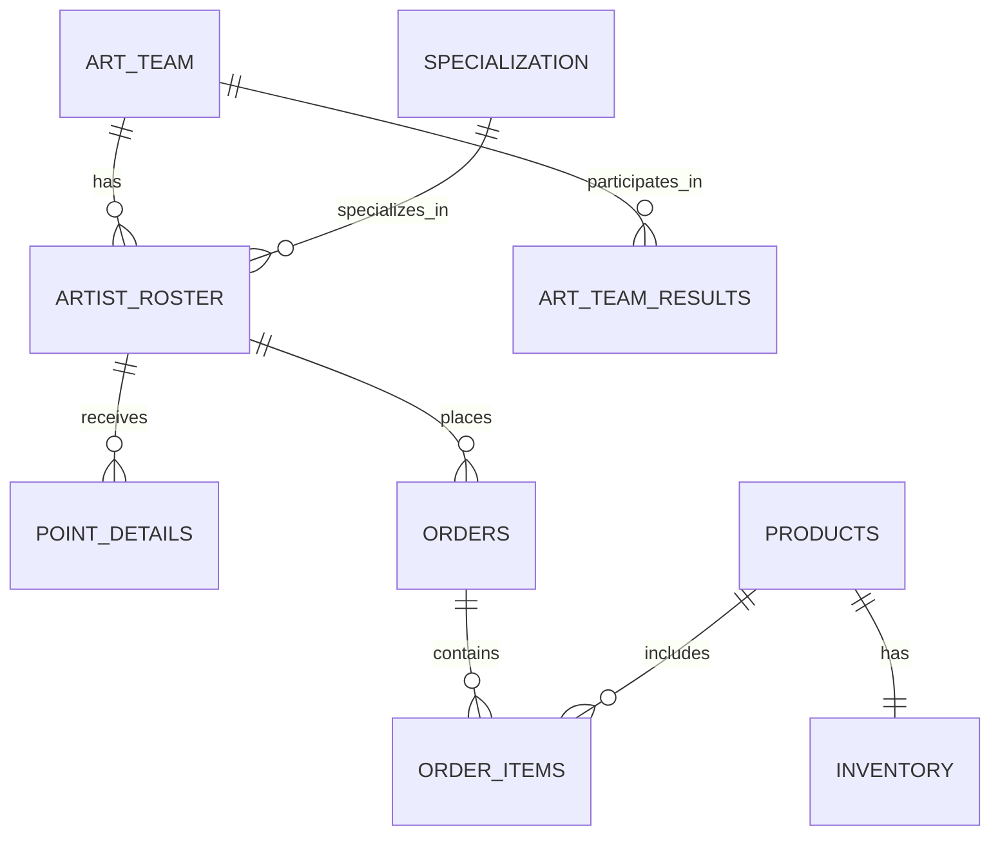
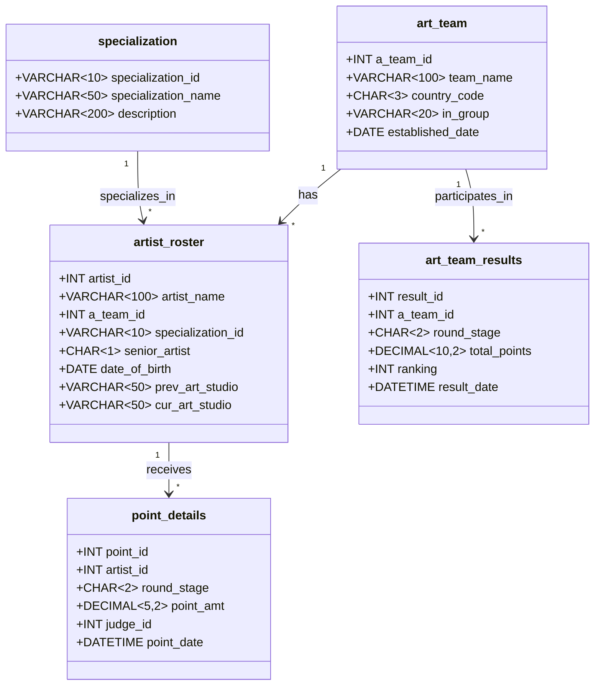

# 数据库设计方法论 - ART_CONTEST 实例详解

## 文档概述

本文档系统阐述数据库设计的完整流程，并以 ART_CONTEST（艺术比赛）数据库为例进行实例说明，帮助开发者掌握专业的数据库设计方法。

---

## 目录

1. [数据库设计概述](#1-数据库设计概述)
2. [需求分析](#2-需求分析)
3. [概念结构设计](#3-概念结构设计)
4. [逻辑结构设计](#4-逻辑结构设计)
5. [物理结构设计](#5-物理结构设计)
6. [数据库实施与维护](#6-数据库实施与维护)
7. [ART_CONTEST 数据库完整设计](#7-art_contest-数据库完整设计)
8. [设计验证与优化](#8-设计验证与优化)

---

## 1. 数据库设计概述

### 1.1 设计目标

数据库设计的核心目标是创建一个**高效、可靠、可扩展**的数据存储系统，满足业务需求并支持未来发展。

### 1.2 设计流程

```
需求分析 → 概念结构设计 → 逻辑结构设计 → 物理结构设计 → 实施与维护
```

### 1.3 设计原则

| 原则 | 说明 |
|------|------|
| **数据完整性** | 确保数据准确性和一致性 |
| **规范化** | 消除数据冗余，避免更新异常 |
| **性能优化** | 合理的索引和查询优化 |
| **可扩展性** | 支持业务增长和功能扩展 |
| **安全性** | 数据访问控制和隐私保护 |

---

## 2. 需求分析

### 2.1 业务背景

ART_CONTEST 是一个艺术比赛管理系统，用于管理参赛艺术家、参赛队伍、比赛结果和评分数据。

### 2.2 需求收集

通过业务调研，确定以下核心需求：

| 需求类别 | 需求描述 |
|----------|----------|
| **艺术家管理** | 管理艺术家信息（姓名、工作室、专长等） |
| **队伍管理** | 管理参赛队伍（队伍信息、所属国家等） |
| **比赛管理** | 管理比赛阶段（小组赛、半决赛、决赛） |
| **评分管理** | 记录评委评分和作品得分 |
| **结果统计** | 统计各阶段比赛结果和排名 |

### 2.3 数据流分析

```
艺术家信息 → 队伍分配 → 比赛报名 → 作品提交 → 评委评分 → 结果统计
```

### 2.4 数据需求清单

| 数据实体 | 关键属性 | 业务规则 |
|----------|----------|----------|
| **Artist（艺术家）** | ID、姓名、出生日期、工作室、专长 | 每位艺术家属于一个队伍 |
| **Team（队伍）** | ID、名称、国家、组别 | 每队有多名艺术家 |
| **Specialization（专长）** | ID、名称、描述 | 支持绘画、摄影、雕塑等 |
| **Result（比赛结果）** | 队伍ID、阶段、得分、排名 | 记录各阶段成绩 |
| **Point（评分）** | 艺术家ID、项目、得分 | 记录详细评分 |

---

## 3. 概念结构设计

### 3.1 实体识别

根据需求分析，识别以下核心实体：

1. **artist_roster** - 艺术家名册
2. **art_team** - 艺术队伍
3. **specialization** - 专长类型
4. **art_team_results** - 队伍比赛结果
5. **point_details** - 评分详情
6. **inventory** - 物资库存
7. **orders** - 订单信息

### 3.2 实体关系模型（ER图）



### 3.3 关系说明

| 关系 | 类型 | 说明 |
|------|------|------|
| art_team → artist_roster | 一对多 | 一个队伍有多个艺术家 |
| specialization → artist_roster | 一对多 | 一个专长有多个艺术家 |
| art_team → art_team_results | 一对多 | 一个队伍参与多个阶段 |
| artist_roster → point_details | 一对多 | 一个艺术家有多个评分 |

---

## 4. 逻辑结构设计

### 4.1 规范化设计

遵循第三范式（3NF），确保：
- 每个非主键属性完全依赖于主键
- 非主键属性之间不存在传递依赖

### 4.2 表结构设计

#### 表1：art_team（艺术队伍）

| 字段名 | 类型 | 约束 | 说明 |
|--------|------|------|------|
| a_team_id | INT | PRIMARY KEY | 队伍ID |
| team_name | VARCHAR(100) | NOT NULL | 队伍名称 |
| country_code | CHAR(3) | NOT NULL | 国家代码 |
| in_group | VARCHAR(20) | NOT NULL | 所属组别 |
| established_date | DATE | | 成立日期 |

#### 表2：specialization（专长类型）

| 字段名 | 类型 | 约束 | 说明 |
|--------|------|------|------|
| specialization_id | VARCHAR(10) | PRIMARY KEY | 专长ID |
| specialization_name | VARCHAR(50) | NOT NULL | 专长名称 |
| description | VARCHAR(200) | | 描述 |

#### 表3：artist_roster（艺术家名册）

| 字段名 | 类型 | 约束 | 说明 |
|--------|------|------|------|
| artist_id | INT | PRIMARY KEY | 艺术家ID |
| artist_name | VARCHAR(100) | NOT NULL | 艺术家姓名 |
| a_team_id | INT | FOREIGN KEY | 所属队伍 |
| specialization_id | VARCHAR(10) | FOREIGN KEY | 专长类型 |
| senior_artist | CHAR(1) | DEFAULT 'N' | 是否资深 |
| date_of_birth | DATE | | 出生日期 |
| prev_art_studio | VARCHAR(50) | | 前工作室 |
| cur_art_studio | VARCHAR(50) | NOT NULL | 当前工作室 |

#### 表4：art_team_results（队伍比赛结果）

| 字段名 | 类型 | 约束 | 说明 |
|--------|------|------|------|
| result_id | INT | PRIMARY KEY | 结果ID |
| a_team_id | INT | FOREIGN KEY | 队伍ID |
| round_stage | CHAR(2) | NOT NULL | 比赛阶段 |
| total_points | DECIMAL(10,2) | | 总得分 |
| ranking | INT | | 排名 |
| result_date | DATETIME | DEFAULT GETDATE() | 记录日期 |

#### 表5：point_details（评分详情）

| 字段名 | 类型 | 约束 | 说明 |
|--------|------|------|------|
| point_id | INT | PRIMARY KEY | 评分ID |
| artist_id | INT | FOREIGN KEY | 艺术家ID |
| round_stage | CHAR(2) | NOT NULL | 比赛阶段 |
| point_amt | DECIMAL(5,2) | NOT NULL | 得分 |
| judge_id | INT | | 评委ID |
| point_date | DATETIME | DEFAULT GETDATE() | 评分日期 |

#### 表6：products（产品信息）

| 字段名 | 类型 | 约束 | 说明 |
|--------|------|------|------|
| product_id | VARCHAR(20) | PRIMARY KEY | 产品ID |
| product_name | VARCHAR(100) | NOT NULL | 产品名称 |
| price | DECIMAL(10,2) | NOT NULL | 价格 |
| version | INT | DEFAULT 1 | 版本号 |

#### 表7：inventory（库存信息）

| 字段名 | 类型 | 约束 | 说明 |
|--------|------|------|------|
| product_id | VARCHAR(20) | PRIMARY KEY | 产品ID |
| stock_qty | INT | DEFAULT 0 | 库存数量 |
| last_update | DATETIME | DEFAULT GETDATE() | 更新时间 |

#### 表8：orders（订单信息）

| 字段名 | 类型 | 约束 | 说明 |
|--------|------|------|------|
| order_id | VARCHAR(20) | PRIMARY KEY | 订单ID |
| customer_id | VARCHAR(20) | NOT NULL | 客户ID |
| order_date | DATETIME | DEFAULT GETDATE() | 下单日期 |
| status | VARCHAR(20) | DEFAULT 'Pending' | 订单状态 |

#### 表9：order_items（订单项）

| 字段名 | 类型 | 约束 | 说明 |
|--------|------|------|------|
| item_id | INT | PRIMARY KEY | 项ID |
| order_id | VARCHAR(20) | FOREIGN KEY | 订单ID |
| product_id | VARCHAR(20) | FOREIGN KEY | 产品ID |
| quantity | INT | NOT NULL | 数量 |
| price | DECIMAL(10,2) | NOT NULL | 单价 |

#### 表10：log_entries（日志记录）

| 字段名 | 类型 | 约束 | 说明 |
|--------|------|------|------|
| log_id | INT | PRIMARY KEY | 日志ID |
| message | VARCHAR(500) | NOT NULL | 日志内容 |
| log_time | DATETIME | DEFAULT GETDATE() | 记录时间 |

### 4.3 约束设计

#### 主键约束

| 表名 | 主键字段 | 说明 |
|------|----------|------|
| art_team | a_team_id | 自增主键 |
| specialization | specialization_id | 业务主键 |
| artist_roster | artist_id | 自增主键 |
| art_team_results | result_id | 自增主键 |
| point_details | point_id | 自增主键 |
| products | product_id | 业务主键 |
| inventory | product_id | 外键作为主键 |
| orders | order_id | 业务主键 |
| order_items | item_id | 自增主键 |
| log_entries | log_id | 自增主键 |

#### 外键约束

| 子表 | 外键字段 | 父表 | 父键字段 | 级联操作 |
|------|----------|------|----------|----------|
| artist_roster | a_team_id | art_team | a_team_id | CASCADE |
| artist_roster | specialization_id | specialization | specialization_id | NO ACTION |
| art_team_results | a_team_id | art_team | a_team_id | CASCADE |
| point_details | artist_id | artist_roster | artist_id | CASCADE |
| inventory | product_id | products | product_id | CASCADE |
| order_items | order_id | orders | order_id | CASCADE |
| order_items | product_id | products | product_id | NO ACTION |

---

## 5. 物理结构设计

### 5.1 索引策略

#### 主键索引（自动创建）
- `PK_art_team`
- `PK_specialization`
- `PK_artist_roster`
- `PK_art_team_results`
- `PK_point_details`
- `PK_products`
- `PK_inventory`
- `PK_orders`
- `PK_order_items`
- `PK_log_entries`

#### 非聚集索引

| 表名 | 索引字段 | 索引名 | 说明 |
|------|----------|--------|------|
| artist_roster | a_team_id | IX_artist_roster_team | 按队伍查询 |
| artist_roster | specialization_id | IX_artist_roster_specialization | 按专长查询 |
| art_team_results | a_team_id, round_stage | IX_results_team_stage | 组合查询 |
| point_details | artist_id, round_stage | IX_points_artist_stage | 组合查询 |
| orders | customer_id | IX_orders_customer | 按客户查询 |
| orders | status | IX_orders_status | 按状态查询 |

### 5.2 数据类型优化

| 字段类型 | 使用场景 | 优化建议 |
|----------|----------|----------|
| INT | ID字段、计数 | 优先使用INT而非BIGINT |
| VARCHAR(n) | 可变长度文本 | 根据实际长度设置n |
| DECIMAL(p,s) | 金额、评分 | 精确控制精度 |
| DATE/DATETIME | 日期时间 | 使用DATE而非DATETIME（仅日期） |
| CHAR(n) | 固定长度编码 | 如国家代码、状态码 |

### 5.3 存储优化

- **分区表**：对于大量历史数据（如评分记录），考虑按时间分区
- **文件组**：将频繁访问的表和索引放在高性能存储上
- **压缩**：对归档数据启用页压缩

---

## 6. 数据库实施与维护

### 6.1 数据库创建

```sql
CREATE DATABASE ART_CONTEST
ON PRIMARY (
    NAME = ART_CONTEST_data,
    FILENAME = 'D:\SQLData\ART_CONTEST.mdf',
    SIZE = 100MB,
    MAXSIZE = UNLIMITED,
    FILEGROWTH = 10MB
)
LOG ON (
    NAME = ART_CONTEST_log,
    FILENAME = 'D:\SQLLogs\ART_CONTEST.ldf',
    SIZE = 50MB,
    MAXSIZE = UNLIMITED,
    FILEGROWTH = 5MB
);
```

### 6.2 权限管理

```sql
-- 创建数据库用户
CREATE LOGIN ART_CONTEST_User WITH PASSWORD = 'StrongPassword123!';
CREATE USER ART_CONTEST_User FOR LOGIN ART_CONTEST_User;

-- 授予权限
GRANT SELECT, INSERT, UPDATE, DELETE ON SCHEMA::dbo TO ART_CONTEST_User;
```

### 6.3 维护计划

| 任务 | 频率 | 说明 |
|------|------|------|
| **完整备份** | 每周 | 全量数据备份 |
| **差异备份** | 每日 | 增量数据备份 |
| **日志备份** | 每15分钟 | 事务日志备份 |
| **索引重建** | 每周 | 优化查询性能 |
| **统计信息更新** | 每日 | 优化查询计划 |

---

## 7. ART_CONTEST 数据库完整设计

### 7.1 实体关系图



### 7.2 设计验证

| 检查表 | 状态 | 说明 |
|--------|------|------|
| 主键完整性 | ✅ | 所有表都有主键 |
| 外键约束 | ✅ | 关联表之间有外键约束 |
| 数据类型合理 | ✅ | 使用适当的数据类型 |
| 索引覆盖 | ✅ | 常用查询有索引支持 |
| 规范化程度 | ✅ | 符合第三范式 |

---

## 8. 设计验证与优化

### 8.1 性能测试

```sql
-- 测试查询性能
SET STATISTICS TIME ON;
SET STATISTICS IO ON;

-- 查询各队伍小组赛成绩
SELECT 
    t.team_name,
    r.round_stage,
    r.total_points,
    r.ranking
FROM art_team t
JOIN art_team_results r ON t.a_team_id = r.a_team_id
WHERE r.round_stage = 'G'
ORDER BY r.total_points DESC;
```

### 8.2 查询优化建议

| 查询场景 | 优化策略 |
|----------|----------|
| 按队伍查询艺术家 | 创建 `IX_artist_roster_team` 索引 |
| 按专长统计 | 创建 `IX_artist_roster_specialization` 索引 |
| 查询比赛结果 | 创建 `IX_results_team_stage` 组合索引 |

### 8.3 扩展规划

| 扩展方向 | 规划 |
|----------|------|
| **数据增长** | 考虑分区表存储历史数据 |
| **高并发** | 考虑读写分离架构 |
| **数据分析** | 建立数据仓库或使用列存储 |

---

## 附录

### A. 数据库设计检查清单

- [ ] 所有实体都有主键
- [ ] 表之间的关系明确
- [ ] 使用适当的数据类型
- [ ] 创建必要的索引
- [ ] 设置完整性约束
- [ ] 考虑性能和可扩展性
- [ ] 文档完整

### B. 命名规范

| 对象类型 | 命名规则 | 示例 |
|----------|----------|------|
| 表名 | 小写，下划线分隔 | `artist_roster` |
| 字段名 | 小写，下划线分隔 | `artist_name` |
| 主键 | `PK_表名` | `PK_artist_roster` |
| 外键 | `FK_子表_父表` | `FK_artist_roster_art_team` |
| 索引 | `IX_表名_字段名` | `IX_artist_roster_team` |
