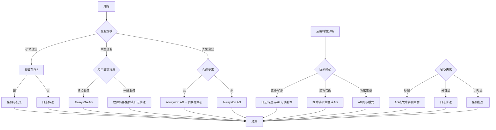
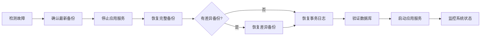

# SQL Server 高可用性方案分析与实施指南

## 文档概述

本文档针对单体应用环境下SQL Server数据库高可用性方案进行全面分析，帮助不同规模企业的技术决策者选择和实施合适的高可用性方案。

---

## 目录

1. [企业规模视角分析](#1-企业规模视角分析)
2. [应用特性视角分析](#2-应用特性视角分析)
3. [高可用性方案对比分析](#3-高可用性方案对比分析)
4. [方案选择决策树](#4-方案选择决策树)
5. [实施步骤与配置](#5-实施步骤与配置)
6. [故障恢复操作手册](#6-故障恢复操作手册)
7. [运维建议](#7-运维建议)

---

## 1. 企业规模视角分析

### 1.1 小微企业（员工<50人，日活用户<1000）

#### 业务连续性需求
- **可接受的停机时间**：数小时
- **数据丢失容忍度**：中等（可接受少量数据丢失）
- **业务影响**：主要影响内部运营

#### 高可用性投入成本平衡
- **预算限制**：有限的IT预算
- **人力限制**：缺乏专职DBA
- **推荐方案**：备份与恢复 + 日志传送（低成本方案）

#### 方案选择建议
| 方案 | 适用度 | 成本 | 复杂度 |
|------|--------|------|--------|
| 备份与恢复 | ★★★★★ | 低 | 低 |
| 日志传送 | ★★★★☆ | 中 | 中 |
| AlwaysOn AG | ★★☆☆☆ | 高 | 高 |

### 1.2 中型企业（员工50-500人，日活用户1000-10000）

#### 业务中断风险评估
- **可接受的停机时间**：分钟级
- **数据丢失容忍度**：低（尽量避免数据丢失）
- **业务影响**：影响客户服务和品牌形象

#### 高可用性策略
- **预算考虑**：有一定IT预算
- **人力配置**：可能有专职DBA或外包支持
- **推荐方案**：AlwaysOn可用性组或故障转移集群

#### 方案选择建议
| 方案 | 适用度 | 成本 | 复杂度 |
|------|--------|------|--------|
| 日志传送 | ★★★★☆ | 中 | 中 |
| 故障转移集群 | ★★★★★ | 中高 | 中高 |
| AlwaysOn AG | ★★★★★ | 高 | 高 |

### 1.3 大型企业（员工>500人，日活用户>10000）

#### 合规要求
- **行业合规**：金融、医疗等行业有严格的合规要求
- **监管要求**：SOX、GDPR等法规要求
- **SLA承诺**：对客户有明确的服务等级承诺

#### 高可用性保障体系
- **RTO目标**：秒级或分钟级
- **RPO目标**：接近零数据丢失
- **推荐方案**：AlwaysOn可用性组 + 多数据中心部署

#### 方案选择建议
| 方案 | 适用度 | 成本 | 复杂度 |
|------|--------|------|--------|
| 故障转移集群 | ★★★★☆ | 中高 | 中高 |
| AlwaysOn AG | ★★★★★ | 高 | 高 |
| 多数据中心部署 | ★★★★★ | 很高 | 很高 |

---

## 2. 应用特性视角分析

### 2.1 应用类型与高可用性需求

| 应用类型 | RTO目标 | RPO目标 | 关键程度 |
|----------|---------|---------|----------|
| 非关键业务（内部管理） | 数小时 | 小时级 | 低 |
| 一般业务（办公系统） | 30分钟 | 15分钟 | 中 |
| 核心业务（交易系统） | 分钟级 | 秒级 | 高 |
| 关键业务（金融交易） | 秒级 | 接近零 | 极高 |

### 2.2 访问模式影响分析

#### 读多写少场景
- **特点**：报表查询、数据分析
- **推荐方案**：日志传送（只读副本用于查询）、AlwaysOn AG（可读副本）

#### 读写均衡场景
- **特点**：普通业务系统
- **推荐方案**：故障转移集群、AlwaysOn AG

#### 写密集型场景
- **特点**：交易系统、实时数据录入
- **推荐方案**：AlwaysOn AG（同步提交模式）、故障转移集群

---

## 3. 高可用性方案对比分析

### 3.1 方案对比矩阵

| 特性 | 备份恢复 | 日志传送 | 数据库镜像 | 故障转移集群 | AlwaysOn AG | 复制 |
|------|----------|----------|------------|--------------|-------------|------|
| **RTO** | 慢（数小时） | 中（分钟级） | 快（秒级） | 快（秒级） | 快（秒级） | 中 |
| **RPO** | 高（可能丢失数据） | 低（日志间隔） | 低（同步模式） | 低 | 低（同步模式） | 中 |
| **只读副本** | 否 | 是 | 是（镜像副本） | 否 | 是（最多8个） | 是 |
| **自动故障转移** | 否 | 否 | 是（需要见证服务器） | 是 | 是 | 否 |
| **跨数据中心** | 是 | 是 | 是 | 受限 | 是 | 是 |
| **成本** | 低 | 中 | 中 | 中高 | 高 | 中 |
| **复杂度** | 低 | 中 | 中高 | 中高 | 高 | 中高 |
| **SQL版本要求** | 所有版本 | 所有版本 | 标准版及以上（已弃用） | 企业版 | 企业版 | 所有版本 |

### 3.2 各方案详细分析

#### 3.2.1 数据库备份与恢复

**原理**：定期备份数据库，故障时恢复到最新备份

**优点**：
- 成本低，配置简单
- 适用于所有SQL Server版本
- 灵活的恢复点选择

**缺点**：
- RTO较长（需要时间恢复）
- 可能丢失备份间隔内的数据
- 需要手动执行恢复

**适用场景**：小微企业、非关键业务、开发测试环境

#### 3.2.2 日志传送

**原理**：主数据库的事务日志定期备份并还原到备用服务器

**优点**：
- 配置相对简单
- 备用服务器可用于只读查询
- 支持跨数据中心部署
- 成本适中

**缺点**：
- 需要手动或脚本实现故障转移
- RPO取决于日志备份间隔
- 只有一个备用服务器

**适用场景**：中小规模企业、读多写少场景、报表查询分流

#### 3.2.3 数据库镜像（已弃用）

**原理**：主数据库的所有操作实时同步到镜像服务器

**优点**：
- 同步模式下RPO接近零
- 支持自动故障转移（需要见证服务器）
- 镜像副本可读（快照）

**缺点**：
- SQL Server 2016+已弃用
- 只支持一个镜像副本
- 需要企业版

**适用场景**：旧版SQL Server环境（建议迁移到AlwaysOn AG）

#### 3.2.4 故障转移集群实例（FCI）

**原理**：多节点共享存储，故障时自动切换到备用节点

**优点**：
- 自动故障转移（秒级）
- 对应用透明
- 共享存储保证数据一致性

**缺点**：
- 共享存储是单点故障
- 需要Windows Server故障转移集群
- 不支持跨数据中心（需要SAN复制）

**适用场景**：中型企业、需要快速故障转移的场景

#### 3.2.5 AlwaysOn可用性组（AG）

**原理**：多个副本同步/异步复制，支持自动故障转移

**优点**：
- 支持多个副本（最多9个）
- 同步模式RPO接近零
- 自动故障转移
- 可读副本支持查询分流
- 支持跨数据中心部署

**缺点**：
- 需要SQL Server企业版
- 配置复杂
- 成本较高

**适用场景**：大型企业、核心业务系统、高要求的RTO/RPO场景

#### 3.2.6 复制技术

**原理**：将数据从发布服务器复制到订阅服务器

**优点**：
- 灵活的复制拓扑
- 支持异构环境
- 订阅服务器可读

**缺点**：
- 不支持自动故障转移
- 可能有数据延迟
- 配置复杂

**适用场景**：数据分发、报表系统、跨平台数据同步

---

## 4. 方案选择决策树



---

## 5. 实施步骤与配置

### 5.1 备份与恢复方案配置

#### 5.1.1 完整备份脚本

```sql
-- 完整备份
BACKUP DATABASE ART_CONTEST
TO DISK = 'D:\SQLBackup\ART_CONTEST_FULL.bak'
WITH 
    INIT,
    COMPRESSION,
    STATS = 10,
    DESCRIPTION = '完整备份 - ART_CONTEST数据库';
GO
```

#### 5.1.2 差异备份脚本

```sql
-- 差异备份
BACKUP DATABASE ART_CONTEST
TO DISK = 'D:\SQLBackup\ART_CONTEST_DIFF.bak'
WITH 
    DIFFERENTIAL,
    COMPRESSION,
    STATS = 10,
    DESCRIPTION = '差异备份 - ART_CONTEST数据库';
GO
```

#### 5.1.3 事务日志备份脚本

```sql
-- 事务日志备份
BACKUP LOG ART_CONTEST
TO DISK = 'D:\SQLBackup\ART_CONTEST_LOG.trn'
WITH 
    COMPRESSION,
    STATS = 10,
    DESCRIPTION = '事务日志备份 - ART_CONTEST数据库';
GO
```

#### 5.1.4 恢复脚本

```sql
-- 恢复数据库（完整恢复模式）
RESTORE DATABASE ART_CONTEST
FROM DISK = 'D:\SQLBackup\ART_CONTEST_FULL.bak'
WITH 
    NORECOVERY,
    REPLACE;

-- 恢复差异备份
RESTORE DATABASE ART_CONTEST
FROM DISK = 'D:\SQLBackup\ART_CONTEST_DIFF.bak'
WITH NORECOVERY;

-- 恢复事务日志
RESTORE LOG ART_CONTEST
FROM DISK = 'D:\SQLBackup\ART_CONTEST_LOG.trn'
WITH RECOVERY;
GO
```

### 5.2 日志传送配置

#### 5.2.1 主服务器配置

```sql
-- 配置日志传送 - 主服务器
USE master;
GO

-- 启用日志传送
EXEC sp_add_log_shipping_primary_database
    @database = N'ART_CONTEST',
    @backup_directory = N'D:\SQLBackup\LogShipping',
    @backup_share = N'\\PRIMARY\LogShipping',
    @backup_job_name = N'LSBackup_ART_CONTEST',
    @backup_retention_period = 720,  -- 30天
    @monitor_server = N'MONITOR',
    @monitor_server_security_mode = 1;
GO
```

#### 5.2.2 辅助服务器配置

```sql
-- 配置日志传送 - 辅助服务器
USE master;
GO

EXEC sp_add_log_shipping_secondary_primary
    @primary_server = N'PRIMARY',
    @primary_database = N'ART_CONTEST',
    @backup_source_directory = N'\\PRIMARY\LogShipping',
    @backup_destination_directory = N'D:\SQLBackup\LogShipping',
    @secondary_database = N'ART_CONTEST',
    @restore_job_name = N'LSRestore_ART_CONTEST',
    @monitor_server = N'MONITOR',
    @monitor_server_security_mode = 1;
GO

-- 设置辅助数据库为只读模式
EXEC sp_add_log_shipping_secondary_database
    @secondary_database = N'ART_CONTEST',
    @restore_delay = 0,
    @restore_mode = 1,  -- 1=NORECOVERY, 2=STANDBY
    @disconnect_users = 1;
GO
```

### 5.3 AlwaysOn可用性组配置

#### 5.3.1 启用AlwaysOn（PowerShell）

```powershell
# 启用AlwaysOn可用性组功能
Enable-SqlAlwaysOn -ServerInstance "PRIMARY" -Force
Enable-SqlAlwaysOn -ServerInstance "SECONDARY" -Force
```

#### 5.3.2 创建可用性组

```sql
-- 创建可用性组
CREATE AVAILABILITY GROUP AG_ART_CONTEST
WITH (AUTOMATED_BACKUP_PREFERENCE = SECONDARY)
FOR DATABASE ART_CONTEST
REPLICA ON 
    N'PRIMARY' WITH (
        ENDPOINT_URL = N'TCP://PRIMARY:5022',
        AVAILABILITY_MODE = SYNCHRONOUS_COMMIT,
        FAILOVER_MODE = AUTOMATIC,
        SEEDING_MODE = AUTOMATIC
    ),
    N'SECONDARY' WITH (
        ENDPOINT_URL = N'TCP://SECONDARY:5022',
        AVAILABILITY_MODE = SYNCHRONOUS_COMMIT,
        FAILOVER_MODE = AUTOMATIC,
        SEEDING_MODE = AUTOMATIC,
        READ_ONLY_ROUTING_URL = N'TCP://SECONDARY:1433'
    );
GO
```

#### 5.3.3 添加只读路由

```sql
-- 配置只读路由
ALTER AVAILABILITY GROUP AG_ART_CONTEST
MODIFY REPLICA ON N'SECONDARY' WITH 
(READ_ONLY_ROUTING_URL = N'TCP://SECONDARY:1433');
GO

ALTER AVAILABILITY GROUP AG_ART_CONTEST
ADD READ_ONLY_ROUTING LIST FOR REPLICA N'PRIMARY' 
(('SECONDARY'));
GO
```

### 5.4 故障转移集群配置

#### 5.4.1 创建Windows故障转移集群（PowerShell）

```powershell
# 安装故障转移集群功能
Install-WindowsFeature Failover-Clustering -IncludeManagementTools

# 创建集群
New-Cluster -Name SQLCluster -Node "NODE1","NODE2" -StaticAddress "192.168.1.100"

# 添加磁盘资源
Add-ClusterDisk -Cluster SQLCluster -Name "SQLData"
```

#### 5.4.2 创建SQL Server故障转移实例

```sql
-- 在集群上安装SQL Server后，配置故障转移组
ALTER AVAILABILITY GROUP [SQLCluster]
MODIFY REPLICA ON N'NODE1' WITH (FAILOVER_MODE = AUTOMATIC);
GO
```

---

## 6. 故障恢复操作手册

### 6.1 备份恢复流程



### 6.2 日志传送故障转移步骤

1. **确认主服务器故障**
```sql
-- 检查主服务器状态
SELECT state_desc FROM sys.databases WHERE name = 'ART_CONTEST';
```

2. **在辅助服务器上恢复日志**
```sql
-- 恢复到最新日志
RESTORE LOG ART_CONTEST
FROM DISK = 'D:\SQLBackup\LogShipping\ART_CONTEST_LOG.trn'
WITH RECOVERY;
GO
```

3. **将辅助服务器设为主服务器**
```sql
-- 设置数据库为读写模式
ALTER DATABASE ART_CONTEST SET READ_WRITE;
GO
```

4. **更新应用连接字符串**

### 6.3 AlwaysOn故障转移步骤

#### 自动故障转移（正常情况）
- 系统自动检测故障并转移
- 应用自动重连到新主服务器

#### 手动故障转移

```sql
-- 手动故障转移（计划内维护）
ALTER AVAILABILITY GROUP AG_ART_CONTEST
FAILOVER;
GO

-- 强制故障转移（主服务器不可用）
ALTER AVAILABILITY GROUP AG_ART_CONTEST
FORCE_FAILOVER_ALLOW_DATA_LOSS;
GO
```

### 6.4 故障恢复检查表

| 步骤 | 检查项 | 状态 |
|------|--------|------|
| 1 | 确认故障类型 | □ |
| 2 | 检查最新备份/日志 | □ |
| 3 | 停止相关应用服务 | □ |
| 4 | 执行恢复操作 | □ |
| 5 | 验证数据完整性 | □ |
| 6 | 启动应用服务 | □ |
| 7 | 监控系统状态 | □ |
| 8 | 记录故障报告 | □ |

---

## 7. 运维建议

### 7.1 监控与告警

#### 7.1.1 关键监控指标

| 指标 | 监控目标 | 告警阈值 |
|------|----------|----------|
| 数据库状态 | 确保数据库在线 | 离线超过5分钟 |
| 备份状态 | 确保备份成功 | 备份失败 |
| 日志传送延迟 | 监控同步状态 | 延迟超过15分钟 |
| AlwaysOn同步状态 | 确保副本同步 | 同步失败 |
| 磁盘空间 | 确保有足够空间 | 可用空间<10% |
| CPU使用率 | 监控服务器负载 | >80%持续10分钟 |
| 内存使用率 | 监控内存使用 | >90%持续10分钟 |

#### 7.1.2 监控脚本

```sql
-- 检查AlwaysOn可用性组状态
SELECT 
    ag.name AS AG_Name,
    ar.replica_server_name,
    ar.availability_mode_desc,
    ar.failover_mode_desc,
    rs.role_desc,
    rs.synchronization_health_desc
FROM sys.availability_groups ag
JOIN sys.availability_replicas ar ON ag.group_id = ar.group_id
LEFT JOIN sys.dm_hadr_availability_replica_states rs ON ar.replica_id = rs.replica_id;
GO

-- 检查日志传送状态
SELECT 
    primary_database,
    last_backup_date,
    last_restore_date,
    backup_retention_period
FROM msdb.dbo.log_shipping_monitor_primary;
GO
```

### 7.2 定期维护任务

| 任务 | 频率 | 说明 |
|------|------|------|
| 完整备份 | 每周 | 全量数据备份 |
| 差异备份 | 每日 | 增量数据备份 |
| 事务日志备份 | 每15分钟 | 确保RPO |
| 备份验证 | 每周 | 验证备份可恢复 |
| 索引重建 | 每月 | 维护查询性能 |
| 统计信息更新 | 每周 | 优化查询计划 |
| 故障演练 | 每季度 | 验证故障转移流程 |

### 7.3 文档与培训

- **运维手册**：记录所有配置和操作流程
- **故障手册**：记录常见故障及处理步骤
- **团队培训**：定期进行HA方案培训和演练
- **应急联系人**：建立明确的应急响应机制

---

## 附录

### A. 方案选择速查表

| 企业规模 | 应用类型 | 推荐方案 |
|----------|----------|----------|
| 小微企业 | 非关键业务 | 备份与恢复 |
| 小微企业 | 核心业务 | 日志传送 |
| 中型企业 | 非关键业务 | 日志传送 |
| 中型企业 | 核心业务 | 故障转移集群/AlwaysOn AG |
| 大型企业 | 非关键业务 | AlwaysOn AG |
| 大型企业 | 核心业务 | AlwaysOn AG + 多数据中心 |

### B. 术语表

| 术语 | 说明 |
|------|------|
| **RTO** | Recovery Time Objective，恢复时间目标 |
| **RPO** | Recovery Point Objective，恢复点目标 |
| **HA** | High Availability，高可用性 |
| **FCI** | Failover Cluster Instance，故障转移集群实例 |
| **AG** | Availability Group，可用性组 |
| **SAN** | Storage Area Network，存储区域网络 |

### C. 参考资源

- [SQL Server AlwaysOn文档](https://learn.microsoft.com/zh-cn/sql/database-engine/availability-groups/windows/overview-of-always-on-availability-groups-sql-server)
- [SQL Server备份恢复文档](https://learn.microsoft.com/zh-cn/sql/relational-databases/backup-restore/back-up-and-restore-of-sql-server-databases)
- [日志传送文档](https://learn.microsoft.com/zh-cn/sql/database-engine/log-shipping/about-log-shipping-sql-server)
